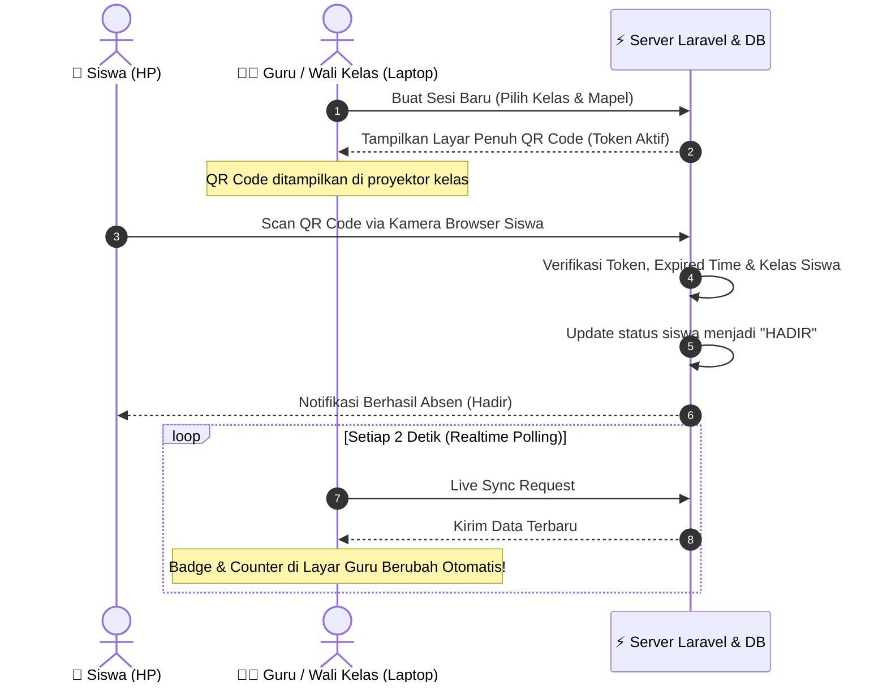

<div align="center">

  

  # ⚡ SMART QR SCHOOL ATTENDANCE SYSTEM
  ### Sistem Presensi Sekolah Modern & Realtime Berbasis Dynamic QR Code

  <p align="center">
    <a href="https://laravel.com"></a>
    <a href="https://tailwindcss.com"></a>
    <a href="https://alpinejs.dev"></a>
    <a href="https://php.net"></a>
    <a href="https://mysql.com"></a>
    <a href="#"></a>
  </p>

  <p align="center">
    <strong>Aplikasi presensi mandiri siswa berbasis pemindaian QR Code interaktif, dilengkapi sinkronisasi realtime tanpa refresh browser, integrasi 40+ mata pelajaran, dan ekspor laporan PDF bulanan khusus Wali Kelas & Guru Mapel.</strong>
  </p>

  ---
</div>

## 🌟 Fitur Unggulan (Gacor & Family Friendly)

```
  ┌───────────────────────┐       SCAN QR        ┌───────────────────────┐
  │   📱 Siswa (HP Scan)   │ ──────────────────>  │  ⚡ Live System Check  │
  └───────────────────────┘                      └───────────────────────┘
                                                             │
                                     Auto-Sync (2s)          ▼
  ┌──────────────────────────────────────────────────────────────────────┐
  │  👨‍🏫 Layar Dashboard Guru / Admin (Tabel Terupdate Instan Tanpa Refresh)│
  └──────────────────────────────────────────────────────────────────────┘
```

### ⚡ 1. Realtime Live Auto-Sync (Tanpa Reload Halaman)
* 🟢 **Instant Update**: Guru membuka QR Code di laptop/proyektor kelas, saat siswa scan dari HP mereka, status siswa di tabel langsung otomatis berganti menjadi **HADIR** dengan animasi pulse hijau lembut.
* 📊 **Live Counter**: Statistik total Hadir, Sakit, Izin, dan Alpa di kartu ringkasan ter-update otomatis seketika setiap 2 detik.

### 📱 2. Smart QR Code Scanner & Anti-Cheat System
* 🔒 **Token 32-Karakter Acak**: Setiap sesi memiliki token kriptografi unik yang mustahil ditebak.
* ⏳ **Auto-Expire 30 Menit**: Barcode otomatis kedaluwarsa setelah 30 menit untuk mencegah siswa yang terlambat atau titip absen.
* 🔐 **Kunci / Buka Sesi Fleksibel**: Guru dapat mengunci barcode saat kelas dimulai dan mengaktifkannya kembali kapan saja jika diperlukan.

### 📚 3. Integrasi Master Mata Pelajaran (40+ Mapel)
* 🎓 **Sesi Kelas & Sesi Mapel**: Membedakan antara **Sesi Pagi (Presensi Harian Wali Kelas)** dan **Sesi Mapel (Presensi Guru Mata Pelajaran)**.
* ⏰ **Jadwal & Jam Pelajaran**: Pencatatan jam pelajaran spesifik (contoh: *07.30 - 09.00 WIB*).
* 📋 **Auto-Copy Presensi Pagi**: Saat guru mapel membuat sesi, status kehadiran otomatis disinkronkan dari data sesi pagi wali kelas sehingga siswa tidak perlu scan berulang kali saat HP sudah dikumpulkan.

### 📄 4. Generator Rekap PDF Cerdas & Rapi
| Jenis Rekap | Deskripsi & Format |
|---|---|
| 👨‍🏫 **Rekap Bulanan Wali Kelas** | Menampilkan tanggal-tanggal aktif yang ada kegiatan sesi, total rekapitulasi `H`, `S`, `I`, `A`, perhitungan persentase kehadiran nyata, dan status evaluasi siswa. |
| 📖 **Rekap Bulanan Guru Mapel** | Menampilkan format per **Pertemuan Tatap Muka** (`P.1`, `P.2`, `P.3`, dst) lengkap dengan jam pelajaran & status ketuntasan mapel (*TUNTAS / TUGAS TAMBAHAN / REMEDIAL*). |
| 🕒 **Rekap Harian & Detail Sesi** | Format cetak cepat per pertemuan yang siap di-print kapan saja dalam format portrait/landscape. |

### 🛡️ 5. Log Perubahan & Audit Trail Lengkap
* 📜 **Catatan Transparan**: Setiap perubahan manual status siswa (misal: dari *Alpa* diubah ke *Sakit* atau *Izin*) dicatat secara permanen.
* 🔍 **Multi-Filter Cepat**: Riwayat log dapat difilter berdasarkan **Kelas**, **Mata Pelajaran**, **Guru Pembuat/Pengubah**, dan **Tanggal**.

---

## 🛠️ Stack Teknologi

| Komponen | Teknologi | Keterangan |
|---|---|---|
| **Framework Backend** |  | Routing, Eloquent ORM, Controllers, Middleware |
| **Bahasa Pemrograman**|  | Backend engine dengan Carbon Localization ID |
| **User Interface** |  | Design modern, responsif, dan clean |
| **Reaktivitas Frontend**|  | Modal, dropdowns, dan live polling DOM sync |
| **QR Code Engine** | `QRCode.js` & `Html5-QRCode` | Generator QR Code di dashboard & scanner kamera di HP |
| **Database** |  | Relasi tabel yang teroptimasi dengan index |

---

## 🔄 Alur Kerja Sistem (Workflow Diagram)



---

## 🚀 Panduan Instalasi Cepat

### 1. Clone Repository
```bash
git clone https://github.com/Hotwill2/absensi-sekolah.git
cd absensi-sekolah
```

### 2. Install Dependencies
```bash
# Install PHP Dependencies
composer install

# Install Frontend Dependencies
npm install
```

### 3. Konfigurasi Environment (`.env`)
Duplikat file `.env.example` dan sesuaikan kredensial database Anda:
```bash
cp .env.example .env
php artisan key:generate
```
Pastikan pengaturan database di file `.env` sudah benar:
```env
DB_CONNECTION=mysql
DB_HOST=127.0.0.1
DB_PORT=3306
DB_DATABASE=absensi_sekolah
DB_USERNAME=root
DB_PASSWORD=

APP_TIMEZONE=Asia/Jakarta
APP_LOCALE=id
```

### 4. Jalankan Migrasi & Seeder Database
```bash
# Jalankan migrasi tabel beserta 40+ data mapel dan akun contoh
php artisan migrate --seed
```

### 5. Kompilasi Aset Frontend & Jalankan Server
```bash
# Jalankan bundler Vite
npm run dev

# Di terminal terpisah, jalankan server lokal Laravel
php artisan serve
```
Buka browser dan akses: `http://localhost:8000`

---

## 🔐 Akun Demo Default

| Role | Username / NIK / NISN | Password | Keterangan |
|---|---|---|---|
| **Admin** | `admin` | `password` | Akses penuh CRUD, log, reset & export |
| **Guru** | `198501012010011001` (NIK Guru) | `password` | Kelola sesi, tampilkan barcode, edit & cetak |
| **Siswa** | `0081234567` (NISN Siswa) | `password` | Dashboard siswa, scan barcode mandiri |

---

## 📄 Format Laporan Presensi PDF

* 🖨️ **Cetak Langsung dari Browser**: Menggunakan CSS Print Media Queries canggih (`@media print`), tidak memerlukan ekstensi PDF server yang berat.
* 📑 **Format Landscape Bersih**: Otomatis pas di kertas A4 saat memilih opsi *Save as PDF* atau cetak langsung ke printer.
* 🖋️ **Kop & Tanda Tangan Resmi**: Dilengkapi NIP/NIK wali kelas, guru mapel, dan kepala sekolah.

---

<div align="center">
  <sub>Dikembangkan dengan ❤️ untuk kemudahan dan efisiensi manajemen presensi sekolah.</sub>
</div>
