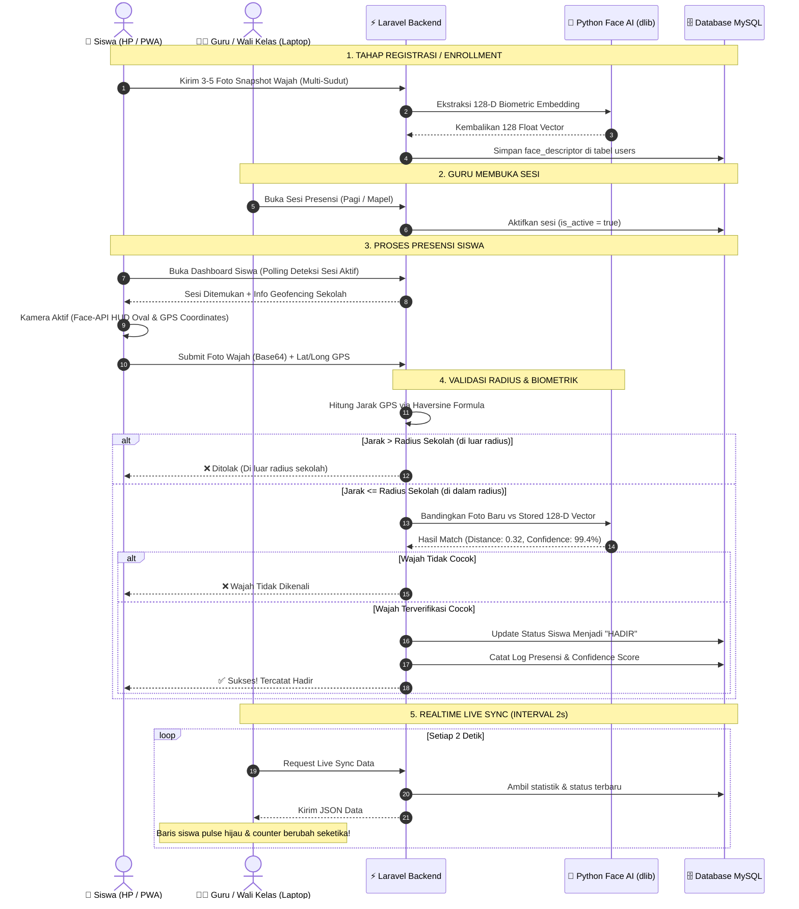

<div align="center">

  

  # ⚡ SMART AI FACE RECOGNITION & GEOFENCING
  ### Sistem Presensi Sekolah Modern Berbasis AI Biometric Face ID, GPS Geofencing Radius, & Realtime Live Sync

  <p align="center" style="margin-top: 12px; margin-bottom: 16px;">
    <a href="https://laravel.com"></a>
    <a href="https://www.python.org"></a>
    <a href="#"></a>
    <a href="https://leafletjs.com"></a>
    <a href="https://tailwindcss.com"></a>
    <a href="https://alpinejs.dev"></a>
    <a href="#"></a>
    <a href="#"></a>
  </p>

  <p align="center">
    <strong>Aplikasi presensi mandiri siswa tercanggih dengan verifikasi wajah AI (128-D biometric vector), validasi radius GPS sekolah (Haversine Formula), sinkronisasi realtime tanpa refresh halaman, pembagian sesi harian & 40+ mata pelajaran, serta generator laporan PDF resmi untuk Wali Kelas & Guru Mapel.</strong>
  </p>

  <!-- ANIMATED SVG BANNER: FACE SCANNER HUD -->
  <p align="center">
    
  </p>

</div>

---

## 🚀 Sekilas Sistem Baru: Dari QR Code ke AI Face ID & Geofencing

Sistem ini telah **berevolusi dari metode QR Code konvensional menjadi AI Biometric Face Recognition & GPS Geofencing**. Peningkatan ini mengatasi kelemahan barcode (seperti titip absen, foto QR dioper antar murid, atau pemindaian di luar lingkungan sekolah).

```
   TRADISIONAL (OLD)                          SISTEM CERDAS (NOW)
┌───────────────────────┐            ┌─────────────────────────────────────────┐
│ 📷 Scan QR Code        │            │ 🤖 AI Face ID Scanner (128-D Vector)     │
│ (Rentan titip absen &  │   ====>    │ 📍 GPS Geofencing Lock (Radius Sekolah) │
│ screenshot barcode)   │            │ ⚡ Live Auto-Sync Tanpa Refresh Browser │
└───────────────────────┘            └─────────────────────────────────────────┘
```

> [!IMPORTANT]
> **Tingkat Keamanan Ganda (Dual Security Layer)**: Siswa hanya dapat tercatat **HADIR** jika **wajah cocok dengan data biometrik (Python dlib ResNet Euclidean Distance ≤ 0.45)** DAN **posisi perangkat berada di dalam radius sekolah yang diizinkan**.

---

## ✨ Fitur Unggulan (Next-Gen Biometrics)

<!-- ANIMATED SVG CARDS: DUAL SECURITY & LIVE SYNC -->
<p align="center">
  
</p>

### 👤 1. AI Biometric Face Recognition (Face ID Anti-Spoofing)
* 📸 **Multi-Angle Face Enrollment**: Siswa mendaftarkan wajah dengan mengambil 3-5 snapshot dari berbagai sudut (lurus, senyum, sedikit toleh) saat registrasi untuk membangun profil embedding biometrik yang akurat.
* 🧠 **128-Dimensional Face Embedding**: Backend Python memanfaatkan model dlib ResNet untuk mengekstrak vektor matematis 128-dimensi wajah dan menyimpannya secara aman di database.
* 🎯 **Strict Verification Threshold**: Menggunakan Euclidean Distance ketat (`≤ 0.45`), memastikan presensi tidak dapat dikelabui dengan foto cetak, masker, atau foto dari layar ponsel lain.
* 🪟 **Live Camera HUD Oval Guide**: Antarmuka kamera browser ditenagai `@vladmandic/face-api` dengan panduan oval interaktif, deteksi landmark wajah seketika, dan visual laser scanning animatif.

### 📍 2. Dynamic GPS Geofencing (Radius Kehadiran Sekolah)
* 🗺️ **Peta Interaktif Admin**: Admin sekolah dapat menentukan koordinat Latitude & Longitude sekolah serta radius toleransi (contoh: *100 meter*) langsung menggunakan peta interaktif **Leaflet.js**.
* 🛰️ **Haversine Distance Formula**: Setiap kali siswa menekan tombol presensi, sistem menghitung jarak riil perangkat ke titik pusat sekolah menggunakan formula Haversine matematis.
* 🚫 **Auto-Reject Diluar Radius**: Jika siswa mencoba absen dari rumah atau luar batas gerbang sekolah, sistem otomatis menolak presensi dan menampilkan informasi jarak aktual.

### ⚡ 3. Realtime Live Auto-Sync (Tanpa Reload Halaman)
* 🟢 **Instant Dashboard Update**: Guru dan Wali Kelas membuka dashboard presensi di laptop atau proyektor kelas. Saat siswa sukses verifikasi wajah lewat HP, status siswa di tabel langsung berganti menjadi **HADIR** dengan animasi pulse hijau seketika (interval polling 2 detik).
* 📊 **Live Statistical Counters**: Kartu ringkasan total *Hadir*, *Sakit*, *Izin*, dan *Alpa* ter-update otomatis tanpa perlu memuat ulang browser (*Zero Reload DOM Sync*).

### 📚 4. Master 40+ Mata Pelajaran & Sesi Berjenjang
* 🌅 **Sesi Pagi (Wali Kelas) vs Sesi Mapel (Guru Mata Pelajaran)**: Mendukung presensi harian umum sekolah dan presensi per jam pelajaran mata pelajaran spesifik.
* 📋 **Fitur Auto-Copy Presensi Pagi**: Saat guru mapel membuka sesi pelajaran di siang hari, guru dapat langsung menyalin status kehadiran dari sesi pagi wali kelas sehingga siswa tidak perlu scan berulang kali saat HP sudah dikumpulkan di kelas.

### 🛡️ 5. Manajemen Wajah & Audit Trail Admin
* 🔄 **Reset Wajah Individual**: Admin dapat mereset descriptor biometrik siswa tertentu jika terjadi kendala pengenalan wajah atau perubahan fisik.
* 👥 **Batch Reset Wajah ("Reset All Faces")**: Fitur sekali klik untuk mereset seluruh data biometrik siswa di sekolah guna keperluan daftar ulang di awal tahun ajaran baru.
* 📜 **Catatan Audit Trail Transparan**: Setiap perubahan manual oleh guru atau sistem tercatat lengkap dengan nilai confidence score, jarak meter, nama guru pengubah, dan stempel waktu.

### 📄 6. Generator Rekap PDF Cerdas & Rapi
| Jenis Laporan | Deskripsi & Format Cetak |
|---|---|
| 👨‍🏫 **Rekap Bulanan Wali Kelas** | Menampilkan seluruh tanggal aktif sesi sekolah, akumulasi rekapitulasi `H`, `S`, `I`, `A`, persentase kehadiran riil, dan status evaluasi kedisiplinan siswa. |
| 📖 **Rekap Bulanan Guru Mapel** | Diformat per **Pertemuan Tatap Muka** (`P.1`, `P.2`, `P.3`, dst) lengkap dengan jam pelajaran, nama guru pengampu, serta status ketuntasan (*TUNTAS / TUGAS TAMBAHAN / REMEDIAL*). |
| 🕒 **Rekap Harian & Cetak Cepat** | Format cetak cepat per sesi pertemuan yang siap di-print kapan saja dengan CSS Print Media Queries (`@media print`) ramah kertas A4. |

### 📱 7. Progressive Web App (PWA) Ready
* 📲 **Installable App**: Siswa dapat menginstal aplikasi presensi langsung ke homescreen smartphone (Android / iOS) via browser dengan dukungan Web App Manifest, offline cache header, dan pengalaman layar penuh (*standalone mode*).

---

## 🔄 Alur Kerja Sistem (End-to-End Workflow)

<!-- ANIMATED SVG WORKFLOW PIPELINE -->
<p align="center">
  
</p>

### Sequence Diagram Interaksi Sistem



---

## 🛠️ Stack Teknologi

| Layer / Komponen | Teknologi | Peran & Deskripsi |
|---|---|---|
| **Backend Framework** |  | Routing, Eloquent ORM, Middleware Role Auth, Controllers |
| **Bahasa Backend** |  | Core backend logic & Carbon Localization Indonesia |
| **AI Biometric Engine** |  | `face_recognition`, `dlib` ResNet, `numpy`, `Pillow` |
| **Frontend Biometric** | `@vladmandic/face-api` | Deteksi wajah kamera real-time, landmark alignment, HUD canvas |
| **GIS & Geofencing** | Leaflet.js & HTML5 Geolocation | Peta interaktif koordinat sekolah & kalkulasi Haversine Formula |
| **User Interface** |  | Desain antarmuka modern, dark/light theme accents, responsif |
| **Frontend Reactive** |  | Modal scanner, polling interval 2 detik, reactivity tanpa overhead |
| **Database** |  | Penyimpanan relasional, index query, json casting face descriptor |
| **Mobile App** | PWA (Progressive Web App) | Web App Manifest, installable ke homescreen smartphone |

---

## 🚀 Panduan Instalasi & Setup

### 1. Clone Repository
```bash
git clone https://github.com/Hotwill2/presensi-sekolah.git
cd presensi-sekolah
```

### 2. Install Dependensi PHP & Frontend
```bash
# Install package PHP Laravel
composer install

# Install package Node.js
npm install
```

### 3. Install Dependensi Python Face Recognition
Pastikan Python 3.10+ sudah terpasang di sistem Anda:
```bash
# Install library AI biometrik
pip3 install face-recognition numpy pillow

# Download model weights dlib (shape predictor 68 landmarks & ResNet v1)
bash python/download_models.sh

# Uji kesiapan service Python
python3 python/face_service.py test
```

> [!TIP]
> Jika sistem Anda menggunakan Linux/Ubuntu, pastikan dependensi C++ compiler (`cmake`, `build-essential`, `libopenblas-dev`) sudah terpasang agar instalasi `dlib` berjalan mulus:
> `sudo apt update && sudo apt install -y cmake build-essential python3-dev`

### 4. Konfigurasi Environment (`.env`)
Duplikat file `.env.example` dan sesuaikan kredensial database Anda:
```bash
cp .env.example .env
php artisan key:generate
```
Sesuaikan pengaturan database dan timezone di `.env`:
```env
DB_CONNECTION=mysql
DB_HOST=127.0.0.1
DB_PORT=3306
DB_DATABASE=presensi_sekolah
DB_USERNAME=root
DB_PASSWORD=

APP_TIMEZONE=Asia/Jakarta
APP_LOCALE=id
```

### 5. Jalankan Migrasi Database & Seeder
```bash
# Membuat tabel-tabel, konfigurasi sekolah default, master 40+ mapel & akun contoh
php artisan migrate --seed
```

### 6. Jalankan Server Pengembangan
Buka dua jendela terminal terpisah:
```bash
# Terminal 1: Kompilasi frontend assets
npm run dev

# Terminal 2: Server Laravel
php artisan serve
```
Buka browser Anda dan navigasi ke: `http://localhost:8000`

---

## 🔐 Akun Demo Default

| Role | Identitas Login (NIK / NISN / Username) | Password | Akses & Kemampuan |
|---|---|---|---|
| 👑 **Admin** | `admin` | `password` | Kelola master Siswa, Guru, Kelas, Log Presensi, Reset Wajah, dan Pengaturan Radius Geofencing Sekolah |
| 👨‍🏫 **Guru / Wali Kelas** | `198501012010011001` (NIK Guru) | `password` | Buka sesi kelas & mapel, monitor live sync, koreksi manual status presensi, cetak rekap PDF |
| 🧑‍🎓 **Siswa** | `0081234567` (NISN Siswa) | `password` | Akses dashboard siswa, enroll wajah mandiri, scan presensi Face ID + GPS |

> [!NOTE]
> Siswa demo yang baru dibuat dapat langsung membuka menu **Enroll Wajah** (`/siswa/enroll-wajah`) untuk mendaftarkan foto wajah sebelum melakukan presensi pertama kali.

---

## 📍 Pengaturan Lokasi & Geofencing Sekolah

1. Masuk ke panel **Admin** -> Menu **Pengaturan Lokasi**.
2. Geser pin pada **Peta Interaktif Leaflet** ke posisi gedung sekolah Anda, atau masukkan koordinat Latitude dan Longitude secara manual.
3. Atur **Radius Toleransi (Meter)** (contoh: `100` untuk 100 meter dari titik koordinat).
4. Aktifkan saklar toggle **Aktifkan Geofencing**.
5. Klik **Simpan Pengaturan Lokasi**.

---

## 📄 Format Laporan Presensi PDF

* 🖨️ **Cetak Langsung dari Browser**: Menggunakan standar CSS Print Media Queries (`@media print`), tidak membebani server dengan library PDF eksternal yang berat.
* 📑 **Layout Landscape A4 Otomatis**: Hasil cetak secara presisi tertata rapi saat memilih opsi *Save as PDF* atau kirim langsung ke printer.
* 🖋️ **Lengkap dengan Titimangsa & Tanda Tangan**: Memuat nama & NIP Kepala Sekolah, Wali Kelas, dan Guru Mata Pelajaran bersangkutan.

---

<div align="center">
  <p>
    <sub>Dikembangkan dengan ❤️ untuk modernisasi presensi sekolah yang akurat, transparan, dan anti-cheat.</sub>
  </p>
</div>
